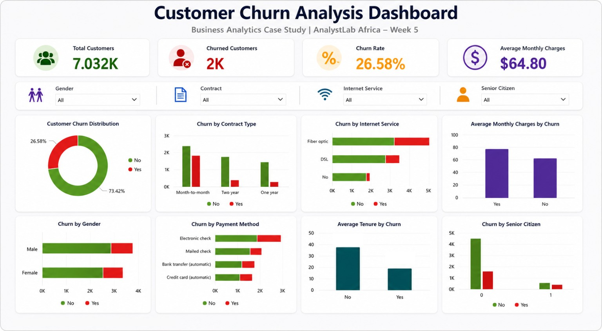

# 📊 Customer Churn Analysis using Python & Power BI

## Business Analytics Case Study | AnalystLab Africa Internship – Week 5

---

## 📌 Project Overview

Customer churn is one of the biggest challenges faced by telecommunication companies. Every customer who leaves represents lost revenue and increased acquisition costs.

This project analyzes customer behaviour using Python and Power BI to identify the major factors influencing churn and provides actionable business recommendations to improve customer retention.

---

## 🎯 Business Problem

The company wants to understand:

- Why customers are leaving.
- Which customer segments are at the highest risk.
- Which business factors contribute most to churn.
- How data can be used to improve customer retention.

---

## 📂 Dataset

**Dataset:** Telco Customer Churn

**Source:** Kaggle

**Records:** 7,043 Customers

**Features:** 21 Variables

The dataset contains customer demographic information, services subscribed, billing information, tenure, contract details, and churn status.

---

## 🛠️ Tools & Technologies

- Python
- Pandas
- NumPy
- Matplotlib
- Jupyter Notebook
- Power BI
- GitHub

---

## 🔄 Project Workflow

```
Business Understanding
        ↓
Data Loading
        ↓
Data Cleaning
        ↓
Exploratory Data Analysis
        ↓
Business Insights
        ↓
Power BI Dashboard
        ↓
Recommendations
```

---

# 📊 Dashboard Preview

> Replace the image below with your final dashboard screenshot.



---

# 📈 Key Performance Indicators (KPIs)

- Total Customers
- Churned Customers
- Churn Rate
- Average Monthly Charges

---

# 📊 Dashboard Features

The interactive dashboard includes:

- Customer Churn Distribution
- Churn by Contract Type
- Churn by Internet Service
- Churn by Gender
- Churn by Payment Method
- Average Monthly Charges by Churn
- Average Tenure by Churn
- Churn by Senior Citizen

Interactive Filters:

- Gender
- Contract
- Internet Service
- Senior Citizen

---

# 🔍 Key Insights

### 📌 Contract Type

Customers with Month-to-Month contracts showed the highest churn rate compared to customers on One-Year and Two-Year contracts.

---

### 📌 Internet Service

Customers subscribed to Fiber Optic internet experienced significantly higher churn than DSL customers.

---

### 📌 Customer Tenure

Customers with shorter tenure were more likely to churn, indicating that retention efforts should focus on new customers.

---

### 📌 Monthly Charges

Customers paying higher monthly charges exhibited a greater likelihood of churning.

---

### 📌 Customer Segments

Senior citizens showed relatively higher churn compared to non-senior customers.

---

# 💡 Business Recommendations

- Encourage customers to migrate to long-term contracts.
- Improve onboarding for new customers.
- Introduce loyalty and retention programs.
- Monitor high-risk customer segments using interactive dashboards.
- Improve customer experience for Fiber Optic subscribers.

---

# 📁 Project Structure

```
Customer-Churn-Analysis/

│── data/
│   ├── customer_churn.csv
│   └── customer_churn_cleaned.csv
│
│── notebook/
│   └── Customer_Churn_Analysis.ipynb
│
│── dashboard/
│   └── Customer Churn Dashboard.pbix
│
│── report/
│   └── Customer_Churn_Report.docx
│
│── presentation/
│   └── Customer_Churn_Presentation.pptx
│
│── images/
│   ├── dashboard.png
│
└── README.md

```

---

# 🚀 Results

The project successfully transformed raw customer data into actionable business insights through data cleaning, exploratory analysis, and interactive dashboard development.

The findings highlight key drivers of churn and provide practical recommendations to improve customer retention and support business decision-making.

---

## 👩🏽‍💻 Author

**Azeemah Sullayman**

- LinkedIn: https://www.linkedin.com/in/azeemah-sullayman
- GitHub: https://github.com/a-zeed

---

## ⭐ If you found this project helpful, consider giving it a star!