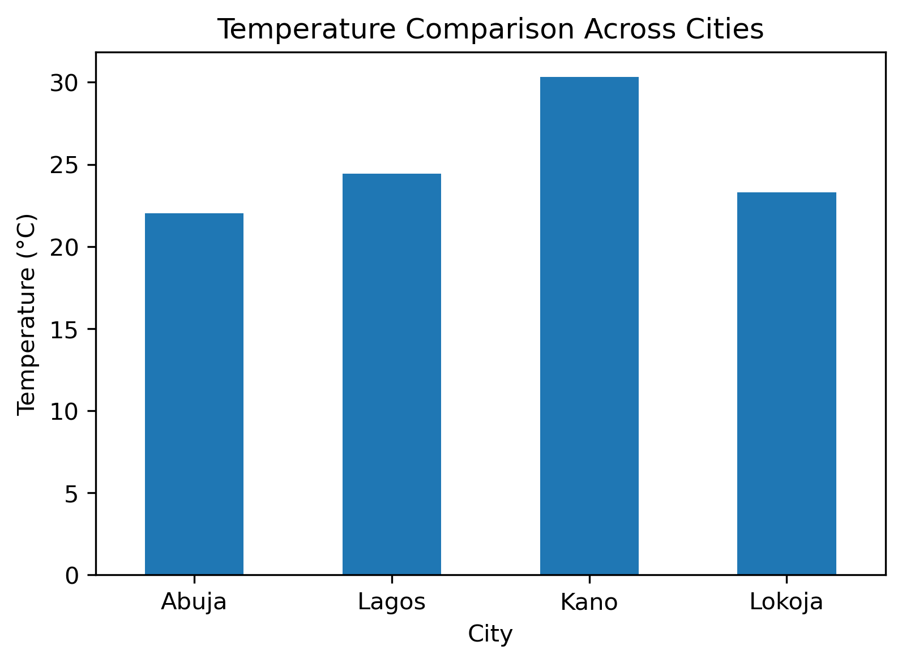
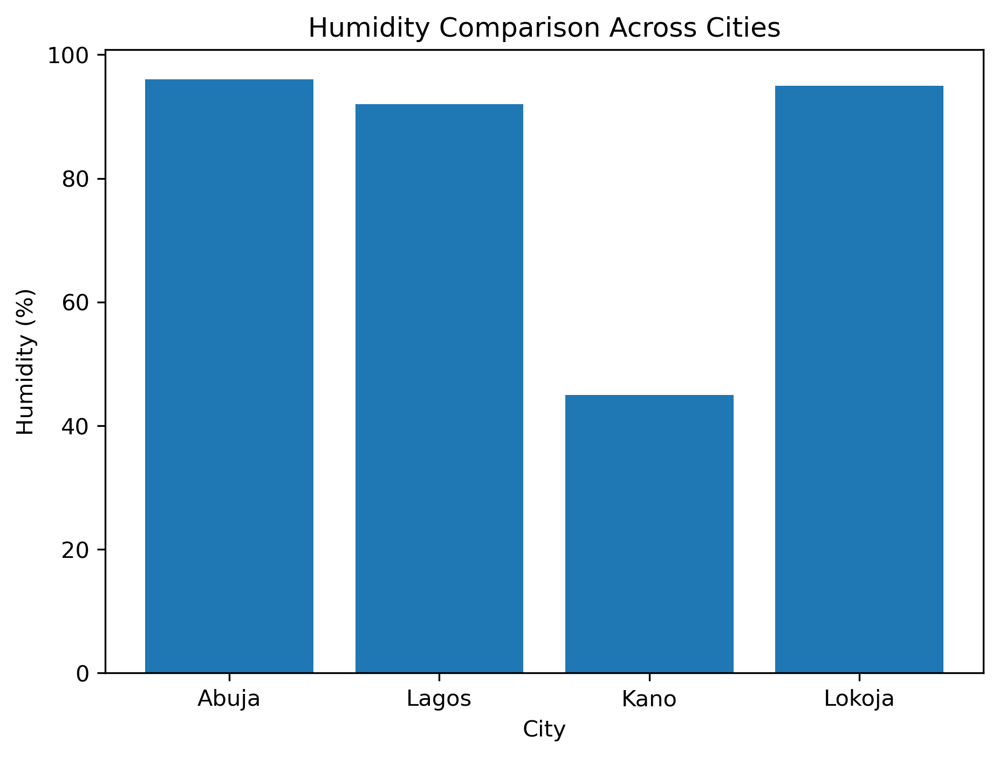

# 🌦️ Weather ETL Pipeline Using OpenWeather API

## Project Overview

This project demonstrates a simple ETL (Extract, Transform, Load) pipeline using Python and the OpenWeather API. Weather data was collected for selected Nigerian cities, transformed into a structured dataset using Pandas, and loaded into a CSV file for future analysis.

The project was completed as part of the **Week 7: Data Pipelines & Automation** project during the AnalystLab Africa Data Analytics Internship.

---

## Objectives

The objectives of this project were to:

- Extract real-time weather data from the OpenWeather API.
- Transform the extracted JSON data into a structured Pandas DataFrame.
- Load the processed dataset into a CSV file.
- Perform basic analysis and visualization of weather data across selected Nigerian cities.

---

## Data Source

- **API:** OpenWeather API
- **Website:** https://openweathermap.org/api

The API was used to retrieve real-time weather information for the following cities:

- Abuja
- Lagos
- Kano
- Lokoja

---

## ETL Process

### 1. Extract

Weather data was extracted from the OpenWeather API using Python's `requests` library. The following information was collected for each city:

- City Name
- Temperature (°C)
- Humidity (%)
- Weather Condition
- Wind Speed (m/s)
- Date & Time

---

### 2. Transform

The extracted JSON data was transformed into a structured Pandas DataFrame by:

- Selecting only the required fields
- Converting the Unix timestamp into a readable date and time
- Organizing the data into a tabular format
- Checking for missing values
- Verifying data types
- Cleaning text fields

---

### 3. Load

The cleaned dataset was successfully loaded into a CSV file, making it available for future analysis and reporting.

**Output File:**

- `weather_data.csv`

---

## Tools Used

- Python
- Jupyter Notebook
- Requests
- Pandas
- Matplotlib
- OpenWeather API
- Git & GitHub

---

## Visualizations

### Temperature Comparison



### Humidity Comparison



---

## Steps Taken

1. Imported the required Python libraries.
2. Connected to the OpenWeather API using an API key.
3. Retrieved weather data for multiple Nigerian cities.
4. Extracted the required weather information.
5. Converted the extracted data into a Pandas DataFrame.
6. Cleaned and validated the dataset.
7. Saved the processed data as a CSV file.
8. Performed basic weather analysis.
9. Created visualizations to compare temperature and humidity across cities.

---

## Key Findings

- Weather data was successfully extracted for Abuja, Lagos, Kano, and Lokoja.
- Temperature varied across the selected cities, demonstrating differences in weather conditions.
- Humidity levels differed between the cities, with one city recording the highest humidity during data collection.
- The extracted data was successfully transformed into a clean Pandas DataFrame and exported as a CSV file.
- The visualizations provided an easy comparison of temperature and humidity across the selected cities.

---

## Project Structure

```text
Week 7/
│
├── ipynb/
│   └── weather_etl.ipynb
│
├── data/
│   └── weather_data.csv
│
├── images/
│   ├── temperature_comparison.png
│   └── humidity_comparison.png
│
├── README.md
└── requirements.txt
```

---

## How to Run the Project

1. Clone this repository.
2. Navigate to the **Week 7** folder.
3. Install the required libraries:

```bash
pip install requests pandas matplotlib
```

4. Open `ipynb/weather_etl.ipynb` in Jupyter Notebook.
5. Replace:

```python
API_KEY = "YOUR_API_KEY"
```

with your own OpenWeather API key obtained from the OpenWeather website.
6. Run all notebook cells from start to finish.

---

## Author

**Azeemah Sullayman**

**Data Analyst | Python | SQL | Power BI | Excel**