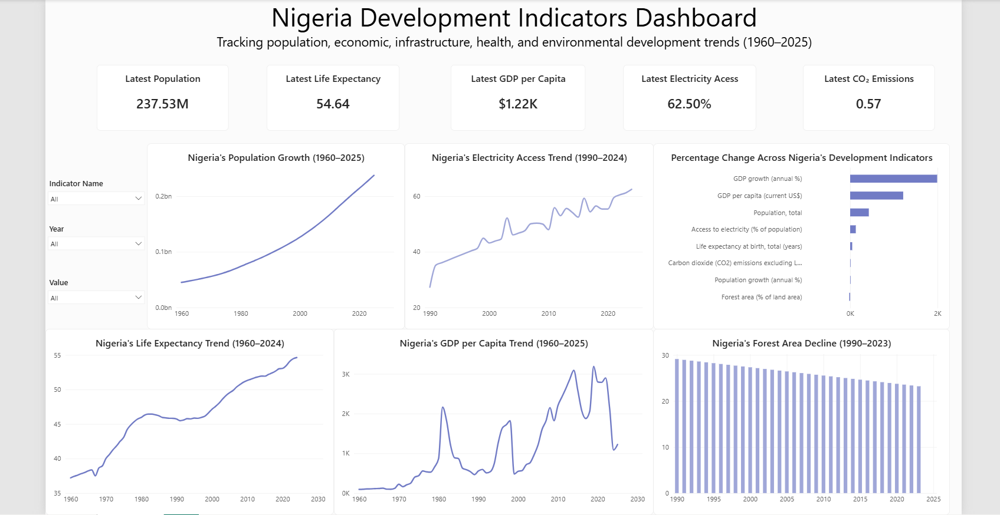

# Nigeria Development Indicators Analysis

A data analytics capstone project analyzing Nigeria's long-term demographic, economic, infrastructure, health, and environmental development trends using World Bank World Development Indicators data.

---

## Project Overview

Nigeria has experienced significant changes in population, economic performance, infrastructure access, health outcomes, and environmental conditions over several decades.

This project analyzes selected development indicators to understand how Nigeria has changed over time and identify key areas of progress and concern.

The project follows an end-to-end data analytics workflow, including:

* Data acquisition
* Data cleaning and preparation
* Exploratory Data Analysis
* Derived metric creation
* Data visualization
* Power BI dashboard development
* Insight generation
* Recommendations

---

## Objective

The objective of this project is to analyze Nigeria's long-term development trajectory using selected indicators from the World Bank's World Development Indicators dataset.

The analysis investigates:

* Population growth and demographic pressure
* GDP per capita and economic performance
* Access to electricity
* Life expectancy
* Forest coverage
* CO₂ emissions
* Percentage change across selected development indicators

### Key Question

> How have key development indicators in Nigeria changed over time, and what do these trends reveal about the country's demographic growth, economic development, infrastructure access, population well-being, and environmental sustainability?

---

## Dataset

### Source

World Bank World Development Indicators (WDI)

The WDI dataset contains global development statistics covering more than 200 countries and territories across areas such as:

* Economy
* Population
* Health
* Education
* Environment
* Infrastructure
* Trade
* Technology
* Governance

### Dataset Scope

The dataset was filtered to include only **Nigeria** and selected indicators relevant to the project.

The final cleaned dataset contains:

* **451 rows**
* **6 columns**
* **0 missing values in the `Value` column**

### Selected Indicators

| Development Area | Indicator                               |
| ---------------- | --------------------------------------- |
| Demographics     | Population, total                       |
| Demographics     | Population growth (annual %)            |
| Economy          | GDP per capita (current US$)            |
| Economy          | GDP growth (annual %)                   |
| Infrastructure   | Access to electricity (% of population) |
| Health           | Life expectancy at birth, total (years) |
| Environment      | Forest area (% of land area)            |
| Environment      | CO₂ emissions (metric tons per capita)  |

---

## Tools and Technologies

* **Python**
* **Pandas**
* **NumPy**
* **Matplotlib**
* **Jupyter Notebook**
* **Power BI**
* **DAX**
* **GitHub**

---

## Data Cleaning and Preparation

The following data preparation steps were performed:

1. Filtered the dataset to include only Nigeria.
2. Selected eight relevant development indicators.
3. Removed unnecessary columns.
4. Checked for missing values.
5. Checked for duplicate records.
6. Standardized data types.
7. Converted the `Year` column to an appropriate numeric format.
8. Converted the `Value` column to a numeric format.
9. Created percentage-change calculations between the earliest and latest available values for each indicator.

### Percentage Change Formula

```text
Percentage Change =
((Latest Value - Earliest Value) / Earliest Value) × 100
```

---

## Exploratory Data Analysis

Exploratory analysis was performed to examine:

* Dataset structure and dimensions
* Data types
* Descriptive statistics
* Minimum and maximum values
* Long-term trends
* Earliest and latest available values
* Percentage change across indicators

---

## Key Findings

### Population Growth

Nigeria's population increased substantially from approximately **45 million in 1960** to over **237 million by 2025**.

This significant population increase has implications for infrastructure, housing, healthcare, education, employment, and public services.

### GDP per Capita

GDP per capita increased significantly over the available period, rising from approximately **$93** in the earliest available observation to approximately **$1,224** in 2025.

However, nominal GDP per capita should be interpreted alongside factors such as inflation, population growth, income distribution, and broader economic conditions.

### Electricity Access

Access to electricity increased from approximately **27% in 1990** to approximately **62.5% in 2024**.

Although this represents substantial progress, a significant proportion of the population still lacked access to electricity in the latest available year.

### Life Expectancy

Life expectancy increased from approximately **37 years in 1960** to approximately **55 years in 2024**, indicating long-term improvement in population health outcomes.

### Forest Area

Forest area declined from approximately **29.1% of land area in 1990** to approximately **23.2% in 2023**.

This represents an approximate **20.3% decline** relative to the earliest available value and highlights concerns related to deforestation and environmental sustainability.

### CO₂ Emissions

CO₂ emissions per capita increased slightly over the available period, with an approximate **9.8% increase**.

This suggests a modest increase in environmental pressure associated with energy consumption and economic activity.

---

## Power BI Dashboard

The interactive Power BI dashboard contains:

### KPI Cards

* Latest Population
* Latest GDP per Capita
* Latest Electricity Access
* Latest Life Expectancy
* Latest CO₂ Emissions

### Visualizations

1. **Nigeria's Population Growth (1960–2025)** — Line chart
2. **Nigeria's GDP per Capita Trend (1960–2025)** — Line chart
3. **Nigeria's Electricity Access Trend (1990–2024)** — Line chart
4. **Nigeria's Forest Area Decline (1990–2023)** — Column chart
5. **Nigeria's Life Expectancy Trend (1960–2024)** — Line chart
6. **Percentage Change Across Nigeria's Development Indicators** — Bar chart

### Interactive Features

* Year slicer
* Indicator Name slicer
* Interactive filtering

### Dashboard Preview



---

## Insights

The analysis reveals that Nigeria has experienced significant demographic and economic growth alongside improvements in infrastructure access and life expectancy.

However, development progress has been uneven.

The substantial increase in population creates increasing demand for infrastructure, healthcare, education, employment, housing, and public services.

At the same time, the decline in forest coverage highlights the environmental costs and sustainability challenges associated with long-term development.

The findings suggest that future development planning should balance economic and demographic growth with environmental protection and sustainable resource management.

---

## Recommendations

Based on the findings, the following recommendations are proposed:

### 1. Expand Electricity Access

Continued investment in electricity generation, transmission, distribution, and renewable energy solutions is necessary to reduce the remaining electricity access gap.

### 2. Plan Infrastructure Around Population Growth

Long-term planning should account for increasing demand for housing, healthcare, education, transportation, water, electricity, and employment.

### 3. Strengthen Forest Conservation

Reforestation, forest protection, sustainable land-use planning, and stronger environmental monitoring should be prioritized to address the decline in forest coverage.

### 4. Promote Sustainable Economic Growth

Economic development should be supported by investments in renewable energy, energy efficiency, cleaner technologies, and sustainable infrastructure.

### 5. Continue Healthcare Investment

Continued investment in healthcare access, preventive healthcare, disease prevention, and healthcare infrastructure is important to support further improvements in life expectancy.

### 6. Support Data-Driven Decision-Making

Development indicators should be regularly monitored and used to evaluate policies, track progress, identify emerging challenges, and support evidence-based decision-making.

---

## Project Structure

```text
Nigeria-Development-Indicators/
│
├── data/
│   └── nigeria_development_indicators_clean.csv
│
├── notebook/
│   └── Nigeria_Development_Indicators_Analysis.ipynb
│
├── dashboard/
│   └── Nigeria Development Indicators Dashboard.pbix
│
├── report/
│   └── Nigeria Development Indicators Report.pdf
│
├── images/
│   └── dashboard_screenshot.png
│
└── README.md
```

---

## Conclusion

This project demonstrates an end-to-end data analytics workflow using real-world development data from the World Bank.

Python was used for data cleaning, preparation, exploratory analysis, and percentage-change calculations, while Power BI was used to develop an interactive dashboard for communicating the findings.

The analysis shows significant population growth, long-term economic growth, improved electricity access, and increased life expectancy. However, the decline in forest coverage and increase in CO₂ emissions highlight important environmental challenges.

Overall, the project demonstrates how data analytics can be used to understand development trends, identify areas of progress and concern, and support more informed decision-making.

---

## Deliverables

* [ ] Jupyter Notebook
* [ ] Cleaned Dataset
* [ ] Power BI Dashboard (`.pbix`)
* [ ] Final Report (PDF)
* [ ] Dashboard Screenshot
* [ ] Demo Video
* [ ] LinkedIn Project Post

---

## Author

**Azeemah Sullayman**

Data Analytics Capstone Project — AnalystLab Africa Internship, Batch B
